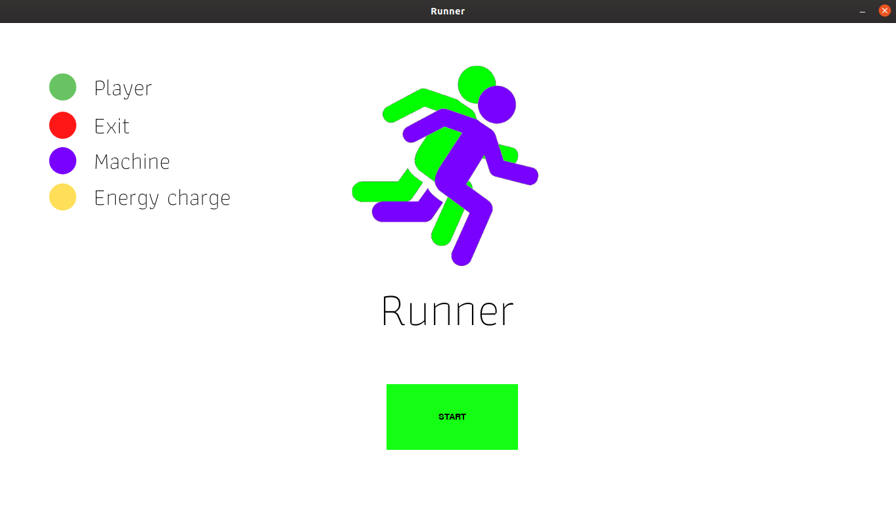
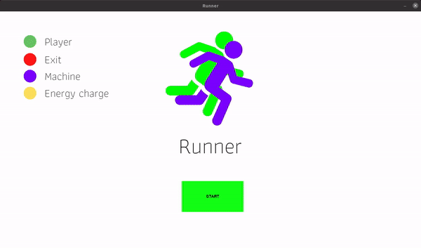
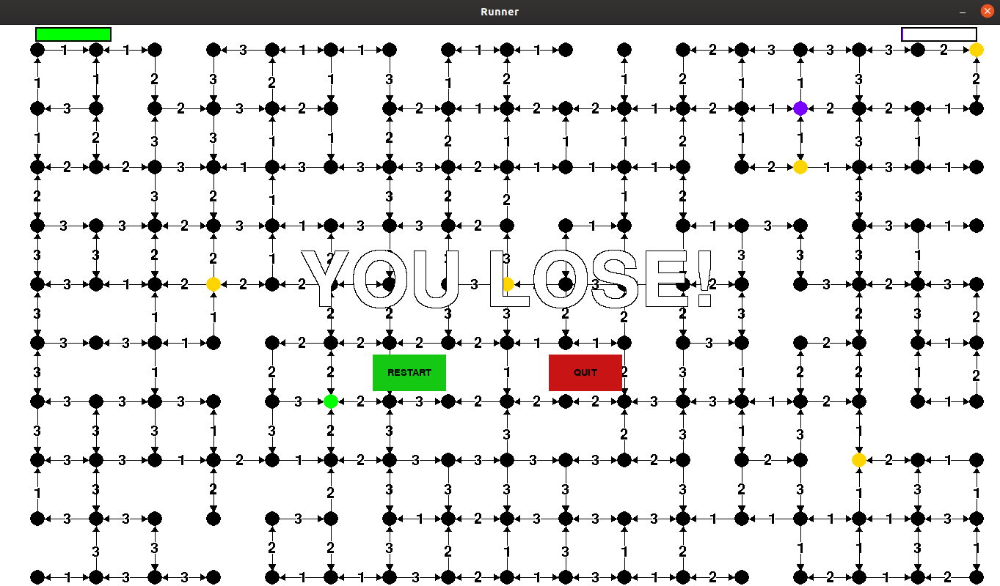

# Runner

**Número da Lista**: 2<br>
**Conteúdo da Disciplina**: Grafos 2<br>

## Alunos
|Matrícula | Aluno |
| -- | -- |
| 17/0129411  |  Guilherme Mendes Pereira |
| 17/0163571 |  Murilo Loiola Dantas |

## Sobre 
Runner é um jogo do gênero corrida. O objetivo do jogador é chegar ao final da fase antes da máquina.

## Screenshots
* Menu:



* Jogo em funcionamento + tela de vitória:



* Tela de derrota:



## Instalação 
**Linguagem**: Python<br>
**Pré-requisitos**: [Python](https://www.python.org/downloads/), [pygame](https://www.pygame.org/wiki/GettingStarted) e [pip](https://packaging.python.org/tutorials/installing-packages/).<br>
**Execução do projeto** <br>

* Clone o repositório:
```bash
git clone https://github.com/projeto-de-algoritmos/Grafos2_Runner.git
```
* Acesse o repositório e instale as bibliotecas necessárias:
```bash
cd Grafos2_Runner/
pip3 install -r requirements.txt
```
* Execute o Runner e divirta-se:
```bash
python3 src/game.py
```

## Uso 

### Vídeo explicativo
[Video](https://github.com/projeto-de-algoritmos/Grafos2_Runner/blob/master/video_explicacao.mp4)

* Player - verde.
* Saída - vermelho.
* Máquina - roxo.
* Recarga de energia - amarelo.

* Clique com o botão esquerdo do mouse em *Start*
* Controle o player com ←, ↑, →,  ↓ do teclado.
* Encontre a saída antes da máquina.
* Clique em *Restart* para jogar novamente.
* Clique em *Quit* para encerrar o jogo.

## Outros 
A máquina sabe o menor caminho, mas sempre começa mais longe da saída do que o jogador.
Preste atenção na barra de energia, não será possível passar por um caminho que exija mais energia do que o jogador possui. As recargas de energia restauram toda a energia de quem passar por elas primeiro, seja a máquina ou o jogador. Cada recarga de energia só pode ser utilizada uma única vez.
O grafo gerado é aleatório e sempre será fortemente conectado.
